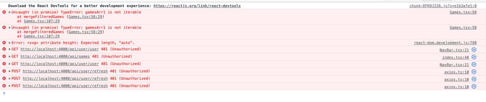
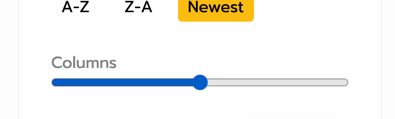
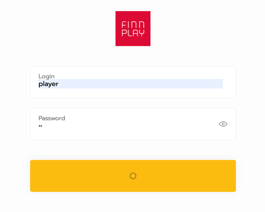
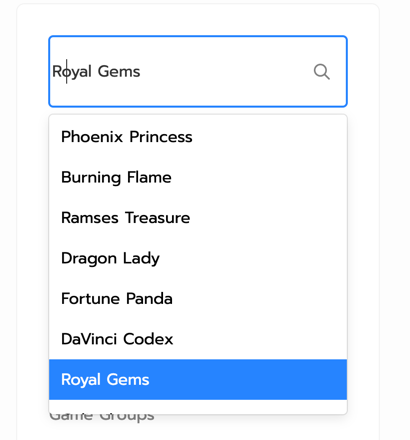
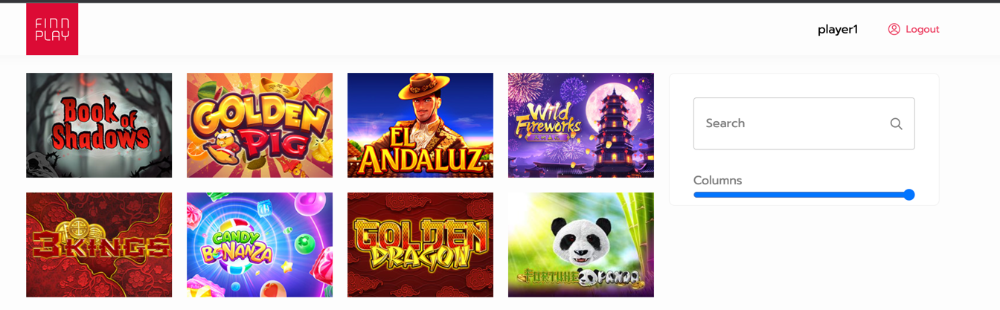
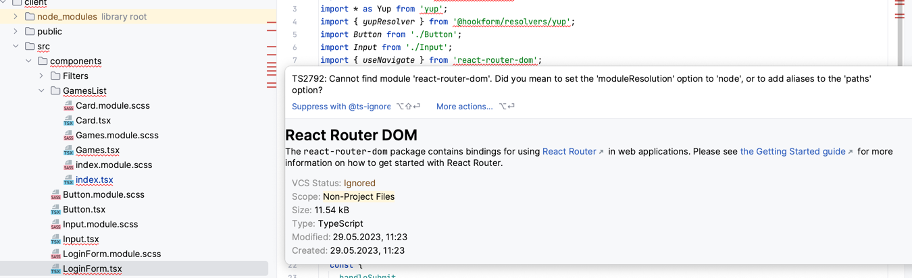
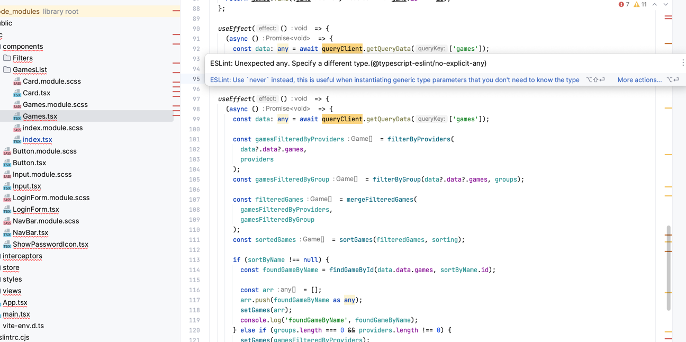
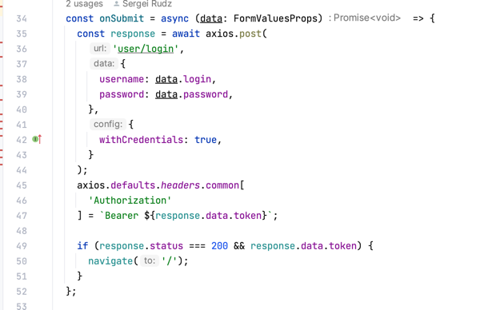
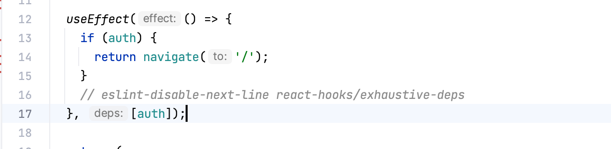

### ⚠️ Not all functions work properly.

**Details:**
   1. Authorization doesn't work
   2. Errors in the console
   3. Extra requests on initial loading, including triple requests to `/refresh` endpoint
      
   4. Blink the main page on initial loading `http://127.0.0.1:5173/`
5. Wrong slider styles
   
6. Search by name doesn't work
7. Login button keeps loading state in case of error
   
8. It should be text input, wrong caret position
   
9. Filter keeps closed state after coming back to desktop view
   
10. It's impossible to use inspector for game list
11. Wrong styles of game thumbnails, there is no hover state, border radius, game title
12. Errors from typescript config
   
13. There are no reasons to use `@tanstack/react-query` here if there is `Redux`
14. A lot of `any`, so, no benefit from using TS
   
15. In case `@reduxjs/toolkit` is used, api calls should be a part of redux actions logic
    
16. Bad practice. And missing dependencies for many effects.
    
17. Sometimes sorting works too slow